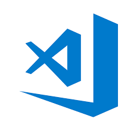

# EDITORS 

## [Microsoft Visual Studio](https://visualstudio.microsoft.com/)

### Pro's :smiley:
* Capable of creating **all** types of programs like web and mobile apps and video games

### Cons :rage:
* Expensive
* Heavyweight 
* Takes considerable resources to: 
..*open 
..*run

### Languages supported
ASP.NET, DHTML, JavaScript, JScript, Visual Basic, Visual C#, Visual C++, Visual F#, XAML and more

## [Netbeans](https://netbeans.org/)
### Pro's :smiley:
* Free
* Simple drag-and-drop interface
### Cons :rage:
* Not alot of themes and backgrounds

### Languages supported
Primarily used for Java apps but supports C, C++, C++11, Fortan, HTML 5, Java, PHP and more

## [VIM](https://www.vim.org/)
### Pro's :smiley:
1. One-key shortcuts
2. 2 Modes: Normal and *Editing* mode. You can record strings and repeat them
3. Has its own scripting language to alter its behavior and add custom functionality
4. Supports the largest number of programming languages and non-programming apps

### Cons :rage:
* Use of mouse is slow
* Doesn't provide WISIWIG editing
* Doesn't show popups in different font
* Doesn't render images
* Have to edit source code in Vim and program it to automatically render preview in other apps

